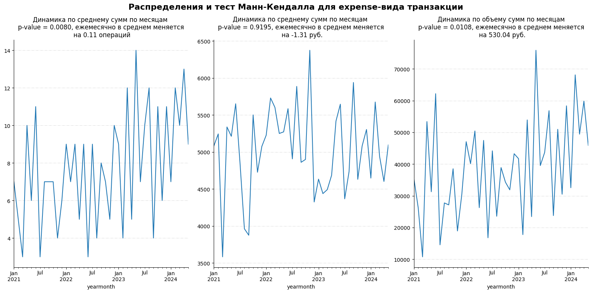
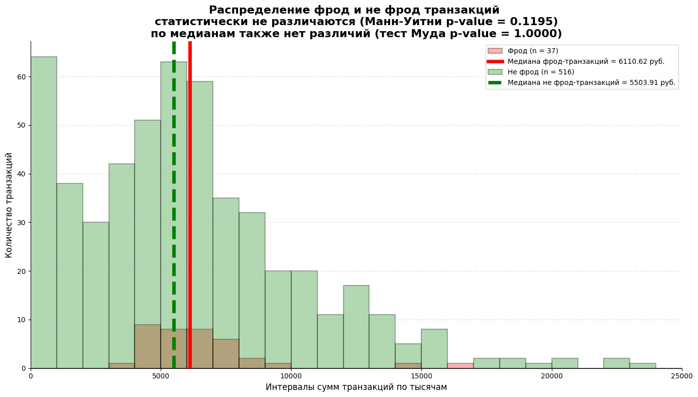

# Финансовый анализ и выявление фродовых транзакций

## Описание проекта

Этот проект направлен на анализ синтетического набора данных с транзакциями для выявления аномалий, трендов и мошеннических операций. 
Данные были сгенерированы с нуля на основе бизнес-логики — с учётом категорий расходов, отделов, одобрения, методов оплаты и фродовых паттернов.

## Что сделано:

- Генерация реалистичных данных (600+ записей)
- Исследовательский анализ данных (EDA) с 15-ю вопросами
- Статистическое тестирование (Манн-Кендалл, Манна-Уитни, тест Муда на медианы, хи-квадрат)
- Анализ сезонности и трендов
- Выявление подозрительных поставщиков и отделов
- Построение модели ML (RandomForest) для детекции фрода по важности признаков
- Визуализация и интерпретация результатов

